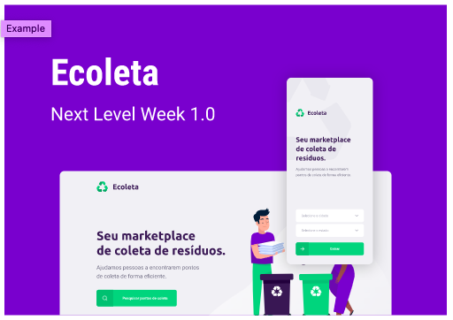

<h3 align="center">
    
    <br><br>
    <b>Recicle e preseve o meio ambiente!</b>  
    <br>
</h3>

<p align="center">
  

  

  	
  <a href="https://www.linkedin.com/in/fabricio-wolff-b621251b1">
    
  </a>
	
  
  <a href="https://github.com/wolfffabricio/ecoleta/commits/master">
    
  </a>

  
   <a href="https://github.com/wolfffabricio/ecoleta/stargazers">
    
  </a>
</p>


# Índice

- [Sobre](#sobre)
- [Tecnologias Utilizadas](#tecnologias-utilizadas)
- [Como Usar](#como-usar)
- [Como Contribuir](#como-contribuir)
- [Licença](#licence)

<a id="sobre"></a>

## :bookmark: Sobre

♻️Ecoleta - é uma forma de conectar empresas e entidades de coleta de resíduos orgânicos e inorgânicos as pessoas que precisam descartar seus resíduos de maneira ecológica.

As empresas ou entidades poderão se cadastrar na plataforma web enviando:
- uma imagem do ponto de coleta
- nome da entidade, email e whatsapp
- e o endereço para que ele possa aparecer no mapa
- além de selecionar um ou mais ítens de coleta: 
  - lâmpadas
  - pilhas e baterias
  - papéis e papelão
  - resíduos eletrônicos
  - resíduos orgânicos
  - óleo de cozinha

Os usuários terão acesso ao aplicativo móvel, onde poderão:
- navegar pelo mapa para ver as instituições cadastradas
- entrar em contato com a entidade através do E-mail ou do WhatsApp

Essa aplicação foi construída na trilha <strong>Booster</strong> da <strong>Next Level Week</strong> distribuída pela [Rocketseat](https://rocketseat.com.br/). A ideia de criar uma aplicação voltada ao meio ambiente surgiu da coincidência da data do curso e a data da <strong>semana do meio ambiente</strong>

<h1 align="center">
    
</h1>

<a id="tecnologias-utilizadas"></a>

## :rocket: Tecnologias Utilizadas

O projeto foi desenvolvido utilizando as seguintes tecnologias

- [TypeScript](https://www.typescriptlang.org/)
- [Node.js](https://nodejs.org/en/)
- [ReactJS](https://reactjs.org/)
- [React Native](https://reactnative.dev/)
- [Expo](https://expo.io/)

<a id="como-usar"></a>

## :fire: Como usar

- ### **Pré-requisitos**

  - É **necessário** possuir o **[Node.js](https://nodejs.org/en/)** instalado na máquina
  - Também, é **preciso** ter um gerenciador de pacotes seja o **[NPM](https://www.npmjs.com/)** ou **[Yarn](https://yarnpkg.com/)**.
  - Por fim, é **essencial** ter o **[Expo](https://expo.io/)** instalado de forma global na máquina

1. Faça um clone :

```sh
  $ git clone https://github.com/wolfffabricio/ecoleta.git
```

2. Executando a Aplicação:

```sh
  # Instale as dependências
  $ npm install

  ## Crie o banco de dados
  $ cd server
  $ npm run knex:migrate
  $ npm run knex:seed

  # Inicie a API
  $ npm run dev

  # Inicie a aplicação web
  $ cd web
  $ npm start

  # Inicie a aplicação mobile
  $ cd mobile
  $ npm start
```

<a id="como-contribuir"></a>

## :recycle: Como contribuir

- Faça um Fork desse repositório,
- Crie uma branch com a sua feature: `git checkout -b my-feature`
- Commit suas mudanças: `git commit -m 'feat: My new feature'`
- Push a sua branch: `git push origin my-feature`

<a id="licence"></a>

## :memo: Licença

Este projeto esta sobe a licença MIT. Veja a [LICENÇA](https://github.com/wolfffabricio/ecoleta/blob/master/LICENSE) para saber mais.


<h4 align="center">
    Feito com 💜 by <a href="https://www.linkedin.com/in/fabricio-wolff-b621251b1" target="_blank">Fabricio Wolff</a>
</h4>
